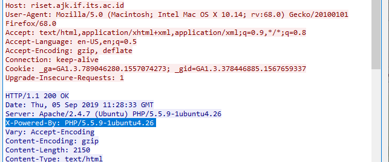
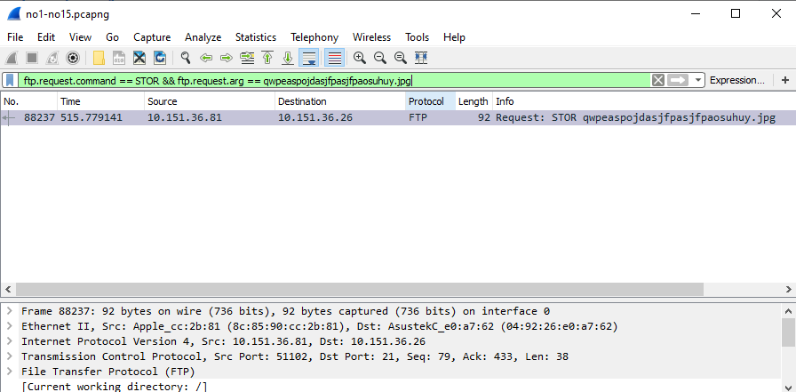
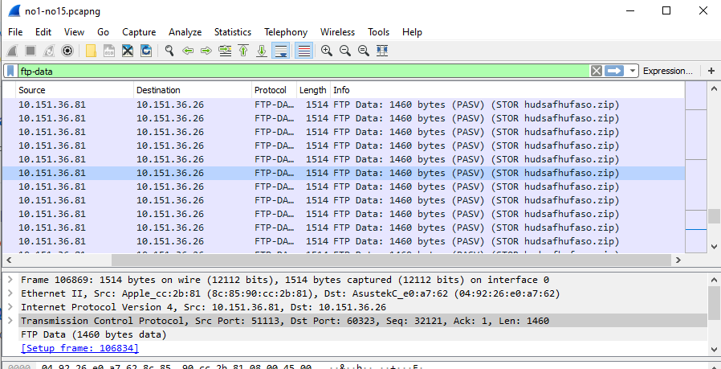

# Lapres_Modul1_JA04

### Kelompok A04:
- Iman Afandy (05111740000129)
- Mochamad Thiesa Nabil (05111740000194)
- Rizky Andre Wibisono (05111740000183)

## Capture Filter
### Nomer 1
Filter sehingga wireshark hanya mengambil paket yang mengandung port 21
#### Jawab:
Langsung gunakan `` port <alamat port>``
```
port 21
```
##### Screenshot:

Port 21 adalah port ftp, dan tidak ada ftp yang sedang saya buka.


### Nomer 2
Filter sehingga wireshark hanya mengambil paket yang berasal dari port 80 (ajk.if.its.ac.id)
#### Jawab:
Untuk mencari paket yang berasal dari port 80 yaitu ajk.if.its.ac.id dapat dengan menggabungkan command ``src port <port>`` dengan ``host <alamat host>``.
```
src port 80 && host ajk.if.its.ac.id
```
##### Screenshot:


### Nomer 3
Filter sehingga wireshark hanya menampilkan paket yang menuju port 443 (google.com)
#### Jawab:
````
dst port 443 && host google.com
````
##### Screenshot:


### Nomer 4
Filter sehingga wireshark hanya mengambil paket yang berasal dari ip kalian.
#### Jawab:
Cek ip kita dengan ``ipconfig`` lalu gunakan ``ip src <ip4 kita>``
```
ip src <ip kalian>
```
##### Screenshot:


### Nomer 5
Filter sehingga wireshark hanya mengambil paket yang tujuannya ke monta.if.its.ac.id
#### Jawab:
````
dst host monta.if.its.ac.id
````
##### Screenshot:


<br />

## Display Filter
### Nomer 1
Tampilkan semua paket yang hostnya mengandung www.ne.its.ac.id
#### Jawab:
```
http.host == ne.its.ac.id
```
#### Screenshot:


### Nomer 2
Tampilkan paket yang hanya berasal dari IP 10.151.36 81 dan menuju web "mb.its.ac.id"
#### Jawab:
```
ip.src == 10.151.36.81 && http.host == "mb.its.ac.id"
```
#### Screenshot:


### Nomer 3
Simpan gambar ckedokteran.PNG
#### Jawab:
Tidak ada karena gambar ckedokteran.PNG memang tidak ada.

#### Screenshot:


### Nomer 4
Cari charset dari halaman "ajk.if.its.ac.id"
#### Jawab:
Tidak ada juga 

### Nomer 5
Cari username dan password ketika login di "freeshare.lp.if.its ac.id"
#### Jawab:
```
http.host == freeshare.lp.if.its.ac.id && frame contains login
```

#### Screenshot:


### Nomer 6
Sebutkan web server yang digunakan pada "www.ne.its.ac.id"
#### Jawab:
```
http.host == ne.its.ac.id
```
lalu klik kanan > follow > TCP stream.

#### Screenshot:


### Nomer 7
Sebutkan versi PHP dan yang digunakan pada "riset.ajk.if.its.ac.id"
#### Jawab:
```
http.host == riset.ajk.if.its.ac.id
```
lalu klik kanan > follow > TCP stream.

#### Screenshot:


### Nomer 8
Filter pada wireshark kalian sehingga menampilkan hasil ping
#### Jawab:
```
icmp
```

#### Screenshot:


### Nomer 9
Dapatkan semua metode GET yang mengakses "monta.if.its.ac.id"
#### Jawab:
```
http.request.method == GET && http.host == monta.if.its.ac.id
```

#### Screenshot:


### Nomer 10
Tunjukkan username dan password yang dimasukkan ketika login FTP
#### Jawab:
```
ftp.request.command == USER || ftp.request.command == PASS
```

#### Screenshot:


### Nomer 11
Tunjukkan di wireshark, paket mana yang dikirimkan FTP client ketika upload file 
#### Jawab:
```
ftp.request.command == STOR && ftp.request.arg == qwpeaspojdasjfpasjfpaosuhuy.jpg
```

#### Screenshot:


### Nomer 12
Tunjukkan di wireshark, paket mana yang dikirimkan FTP client ketika menghapus file 
#### Jawab:
harusnya:
```
ftp.request.command == DELE && ftp.request.arg == qwpeaspojdasjfpasjfpaos.jpg
```
tidak akan muncul, karena file tersebut tidak ada.
cek:
```
ftp.request.command == DELE
```
hanya file tersebut yg ada (cek Capture22.PNG)
#### Screenshot:


### Nomer 13
Tunjukkan di wireshark, paket mana yang dikirimkan FTP client ketika mengganti nama file "sutlin.PNG"
#### Jawab:
```
ftp.request.command == RNFR && ftp.request.arg == sutlin.PNG
```
#### Screenshot:


### Nomer 14
Tunjukkan di wireshark, paket mana yang dikirimkan FTP client ketika download file "sutlun.PNG"
#### Jawab:
```
ftp.request.command == RETR && ftp.request.arg == sutlun.PNG
```

#### Screenshot:


### Nomer 15
Cari file .zip di wireshark lalu download dan extract file tersebut <br />
clue: "50 4B 03 04"
#### Jawab:
1. Cari data ftp
```
ftp-data
```
2. Cari file zip
3. Klik kanan > Follow > TCP Stream
4. Dengan clue tersebut, mungkin berarti mengandung hexadecimal.
5. Maka, pastikan dalam raw.
6. Jika iya, Save as folder berformat zip.
7. Ekstrak zip dan lihat keajaibannya!

#### Screenshot:



